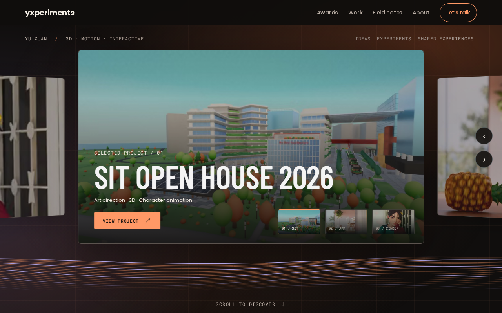

# Portfolio overhaul — design and implementation plan

Prepared: 2026-09-08T12:33:32+08:00. Branch: `codex/portfolio-overhaul-plan`.

Latest user QC implemented 2026-09-10: [visual refinement](../design/portfolio-overhaul/field-notes/qc-refinement.md) replaces the recognition layout with an explicit SIT image/title + awards feature, uses full-frame cover imagery even for small sources, renames the work heading “Selected projects,” adds a running ember/lavender gradient over a fine grid and replaces barely perceptible / desktop-only contour drift with a traveling wave at every width. The earlier native-size / static-phone constraints are superseded; accessibility and visibility motion stops remain.

Latest revision 2026-09-10: **Experimental field notes with charcoal/ember is implemented locally** after user approval. See the [authoritative implementation and verification](../design/portfolio-overhaul/field-notes/implementation.md) and real browser captures. The new Cinder Finished / Field notes view, asymmetric work/process feature, Shophouse Generator and Dune sand previews, concise About/contact, 48s/64s contour loops and clean cue fade are complete. Current stack, Sanity links, archive and route behavior are preserved. Lint, full build, 14 unit and 21 browser checks passed; final image fixes received focused rechecks. No deployment or commit was performed.

One full-width SVG contour surface supersedes all reflection/rendering requirements below. Charcoal/ember supersedes petrol/acid yellow. The field-notes implementation specification supersedes earlier dimensions and composition; older studies below remain historical references.

Historical baseline: the 2026-09-09 Cortiz-inspired revision and its [immersive hero specification](../design/portfolio-overhaul/immersive-hero.md) replaced v4. The 2026-09-10 field-notes implementation above now supersedes both. Deployment remains a separate user-requested action.

## 1. Goal and scope

Create a dark, sleek, image-led portfolio whose opening interaction introduces Yu Xuan's best work. Keep the main journey on one page: **interactive project gallery → awards → projects/process → field notes → concise About → contact**. Preserve the existing React/Vite, styled-components, React Router, Sanity and Vercel setup, current published project links, resume and showreel URLs.

The user selected **SIT Open House 2026** as the opening project. Proposed companion projects are **JPMorgan SAEI** and **Cinder**, showing commercial 3D execution and real-time character work. Their inclusion is an editorial recommendation, not an existing Sanity featured setting.

The attached screenshot supplies visual inspiration: a dominant project preview, perspective, adjacent panels and direct controls. Its labels, browser overlay and other embedded text are reference content, not instructions. Do not reproduce its anime scene or imply that it is Yu Xuan's work.

Existing application changes were already present when this branch was created and must be preserved. The previous release plan is archived unchanged at [release-remediation-2026-07-11.md](../plans/release-remediation-2026-07-11.md). This plan supersedes its visual-design guardrail; historical engineering findings still require fresh verification.

## 2. QC concept and evidence

- [Current geometry, sources, phone composition and effects](../design/portfolio-overhaul/field-notes/implementation.md) are authoritative after the latest user approval. Its linked desktop/phone captures and metrics verify the implemented composition. The remaining studies and original specifications below are historical planning evidence, superseded wherever they conflict with this implementation.

- [Resolved sizing, source assets and mobile specification](../design/portfolio-overhaul/hero-resolution.md): authoritative dimensions, exact asset references, reviewed crop, source-resolution limits, responsive rules and validation criteria.
- [Current laptop concept](../design/portfolio-overhaul/desktop-concept-v4.png) and [all three phone states](../design/portfolio-overhaul/mobile-concept-v4.png). The numeric specification takes precedence over generated proportions; production uses original Sanity media.
- [Fresh hero media inventory](../design/portfolio-overhaul/hero-media-inventory-2026-09-08.json) includes original gallery assets and dimensions, queried read-only at 2026-09-08T13:02:34.537Z. Exact v4 generation/refinement prompts are saved alongside the images.

- [Full-page gradient concept v3](../design/portfolio-overhaul/homepage-concept-v3-dark-gradient.png): retained for lower-page direction; v4 and the resolved specification supersede its hero sizing and source composition. Only gallery project content is reflected, with clean unreflected awards. Static QC illustration; slow wave animation remains to be implemented.
- [Original concept](../design/portfolio-overhaul/homepage-concept-v1.png) and [original generation prompt](../design/portfolio-overhaul/mockup-prompt.txt) are preserved.
- Current exact edit prompts: [dark gradient and reflection scope](../design/portfolio-overhaul/mockup-prompt-v3-dark-gradient.txt) and [caption restoration](../design/portfolio-overhaul/mockup-prompt-v3-caption-refinement.txt).
- [Previous water concept](../design/portfolio-overhaul/homepage-concept-v2-water.png), [initial water prompt](../design/portfolio-overhaul/mockup-prompt-v2-water.txt) and [water refinement prompt](../design/portfolio-overhaul/mockup-prompt-v2-water-refinement.txt) are historical references; their award reflections are superseded.
- [Published Sanity inventory](../design/portfolio-overhaul/sanity-projects-2026-09-08.json): timestamped read-only snapshot with IDs, titles, descriptions, links, images and current ordering.
- Live review: [www.yxperiments.com](https://www.yxperiments.com/), including the rendered desktop opening and Work section. Current local source was also inspected; it contains improvements not present on the deployed site.
- Sanity source: project `5gu0ubge`, dataset `production`, API version `2024-03-14`, published perspective, direct API rather than cached historical fixtures. The snapshot records the exact query URL.

The images establish composition, hierarchy, tone and interaction affordances. They are static concepts, not proof of working drag, animation, responsive behavior or final typography. Generated crops and lettering must not replace original project media. Laptop and all three phone states now have visual studies plus checked layout arithmetic; browser verification remains an implementation requirement.

### Current-site assessment

| Observed evidence | Recommendation and purpose |
| --- | --- |
| The deployed opening centers a blue particle globe, with large Resume and Showreel links; projects are small orbit labels. | Make project imagery the opening interaction. Keep identity visible and make “View project” the main action. |
| Deployed navigation and content put Resume/About before Work. Local Home.jsx already puts Work first. | Use the requested gallery → awards → work order, building on local fixes rather than overwriting them with deployed code. |
| Awards sit inside About, alongside paragraphs and capability cards. | Give recognition its own compact section immediately after the hero, linked to the awarded project. |
| Live Work has a strong large JPMorgan tile but nine tool-oriented filter buttons, including “AFTEREFFECTS”. | Preserve image prominence; use the curated discipline labels already implemented locally, exposed in the expanded archive. |
| Dotted backgrounds, fixed social/contact rails and repeated borders compete with project images. | Use near-black flat surfaces, quiet dividers and fewer controls; move social links to the footer. |
| Main covers include a350px Cinder portrait and681px SIT square. A fresh gallery query also found1920×1080/3840×2160 SIT originals and a500px Cinder capture photo. | Use the selected landscape SIT original, reviewed JPMorgan crop and contained Cinder portrait/capture pairing. See the resolved media specification; video remains optional pending original files. |

The initial planning assessment did not include runtime benchmarks. Fresh implementation measurements and mobile checks are now recorded in implementation-verification.md; earlier continuity results remain historical.

## 3. Art direction

**Concept: a cinematic project gallery.** A dark charcoal-to-midnight-navy interface frames the colorful work, with a muted blue-teal wash behind the stage. Depth comes from the project panels and calm reflective water beneath them. Project reflections fade out at “Scroll to discover”; the continuous background gradient carries the eye into clean, unreflected awards and the remaining content.

- Proposed dark gradient: near-black charcoal `#080B10` at top/edges → midnight navy `#101D32` behind the hero → muted blue-teal `#102629` near the water → slate navy `#101A29` at awards → charcoal `#080B10` toward the footer. Use a broad, low-opacity radial teal wash over a smooth vertical base gradient. Keep a subtle navy cast through lower sections and no hard color bands. These are proposed art-direction stops, not sampled pixels from the generated image.
- Raised surfaces near `#111419`; text `#F4F4F4`; secondary text initially `#A5ADB7`, subject to contrast checks. Retain established `#90D5FF` for focus, selection and primary links. Apply the gradient to a shared background, not independently restarted on every section; keep cards opaque and their media colors natural. Use static CSS gradients so the ambient color adds no animation cost.
- Use the existing sans-serif family for headlines/body and existing monospace only for indices and metadata. Confirm loaded families in global styles before implementation; no new font service is required.
- Desktop outer content width up to1312px with64px gutters at1440px; active hero frame672×378 at1280×800, capped768×432 at1440×900. Lower-section gaps80–120px. Phone gutters20px (16px at320px), lower-section gaps48–64px. Hero/awards transition uses the explicit row budgets in hero-resolution.md.
- Hero heading52px/60px at1280×800,64px/72px at1440×900,36px/40px on390px phone and32px/36px at320px. Section headings36–48px desktop and28–32px phone. Allow natural overflow with large text or short viewports.
- Small 12–20px radii on media panels, fine separators and restrained button borders. Avoid excessive blur/glow, repeated enclosing boxes and busy backgrounds.
- Proposed headline: “Ideas in motion. Worlds to explore.” Keep a visible “Yu Xuan / 3D · Motion · Interactive” identity line and one semantic H1.
- Proposed copy is an editorial paraphrase based on existing content. Do not introduce new clients, availability claims, awards, results or role ownership.

## 4. One-page experience

### Header

Slim persistent header: brand → top; Awards → `/#awards`; Work → `/#works`; About → `/#resume`; Let's talk → `/#contact`. Retain the existing resume anchor and /about redirect. Put Resume, Showreel and R&D links lower on the page.

### Opening gallery

The first viewport must show a recognizable project, the designer's identity, one project action, gallery controls and a scroll cue. Use [the resolved layout](../design/portfolio-overhaul/hero-resolution.md): laptop cue ends at746px and Recognition starts778px in a1280×800 viewport; phone cue ends693px and Recognition starts733px in a390×844 viewport. These are normal-flow target budgets, not fixed text clipping. Allow natural overflow on short screens, wrapping or enlarged text.

1. Load the SIT poster and essential HTML first. Never gate the page on WebGL, video, an intro animation or a loading screen.
2. Show a large active panel with partial decorative neighboring cards on widths1100px and above. Use CSS perspective and transforms, with approximately3–5 degrees maximum pointer tilt. Below1100px use one flat card. All active states share frame/caption allocations; Cinder uses contained portrait/capture images inside the frame. Keep captions readable and prevent page overflow.
3. Provide previous/next buttons, numbered thumbnail buttons and horizontal dragging. Buttons work independently of dragging. Initial order: SIT → JPMorgan → Cinder.
4. Use a 300–450ms transition only when the visitor changes projects. No auto-advance. Settle/cancel transitions cleanly during rapid input.
5. Keep project title, role summary, index and “View project” visible. A stationary HTML caption layer can avoid perspective distortion.
6. “View project” opens the existing route-backed overlay. An optional “Visit experience” for SIT uses its exact Sanity projectLink; the gallery does not embed or rebuild the external campus tour.
7. Motion previews are optional after suitable media exists. Current Sanity entries supply YouTube embeds, not direct loop files. Start with stills; do not download videos from YouTube or load three autoplaying iframes in the opening.
8. If approved original preview files become available, play only the active preview, muted and inline, with a visible pause control. Pause when offscreen, hidden or covered by an overlay; revert to the poster on failure.
9. Vertical wheel/touch scrolling always moves down the page. Do not map the wheel to slide changes or require visitors to inspect every slide before continuing.

Implement the switcher with React state, CSS transforms and Pointer Events in the existing frontend. Keep mounted panels and use eased transform/opacity transitions; fade the wrapping companion out before repositioning it instead of dragging it through the active project. Phones crossfade stable panels. The shared water uses native WebGL without a new dependency and reflects project image pixels only. Per-project live 3D scenes remain a separate scope.

### Reflective water transition — user-requested revision

Create one continuous dark-gradient background spanning the project experience and awards. Restrict reflected content to the project panels before “Scroll to discover”. Water is decorative and always behind foreground images, text and controls. Awards, the scroll cue, navigation and lower sections are never reflection sources.

- User clarification on 2026-09-09 supersedes per-card strips: render exactly one water plane spanning the viewport. Every project floats above the same horizon. Leave28px below the active frame on desktop and22px on phones; recessed companions naturally float higher. Water adds zero layout height, with132px desktop/128px phone depth and a soft fade before the scroll cue.
- Use charcoal/navy water, broad overlapping waves with perspective compression, normal-based cool crest lighting, softened project reflections and restrained atmospheric glow. No repeating-line overlay, individual card-shaped water regions, foam or tall waves.
- Interpret the fade as a spatial opacity gradient. Reflection strength depends on surface/view angle and falls with depth; highlights follow the same wave normals as the distortion. Keep foreground copy readable and awards on a clean gradient.
- Do not mirror or duplicate “CSS Design Awards”, “The FWA”, award descriptions, attribution, the scroll cue or lower-page content. Remove award reflection generation entirely, including in static/reduced-motion states. Show award names and collaboration credit once, upright and crisp on the clean gradient.
- Put gallery and awards inside a shared positioned, isolated wrapper. Background water is the lowest layer; decorative reflections sit above it but below all foreground content. The effect scrolls with this wrapper and ends there; it is not a fixed page-wide overlay.
- `home/ExperienceWater.jsx` mounts once beneath the gallery panels. `lib/waterRenderer.js` shades one canvas and composes a reflection texture from project image pixels at their displayed positions, refreshing during transitions, image loads and resizing. Captions and awards never enter the texture. Optional cross-origin reflection loading must not affect poster display. Unavailable/lost WebGL falls back to the shared dark background.
- Mark the entire decorative subtree `aria-hidden="true"`, make it non-focusable and use `pointer-events: none`. It must not intercept scrolling, dragging, clicks or focus, contribute duplicate accessible award text, or alter document height as it animates.
- Remove the Pause effects button at the user's request. Respect reduced-motion/data-saving preferences and retain static phone water. Stop wave progression during panel transitions, when offscreen, hidden or covered by a project overlay. Reflection positions still follow switching panels. No animation loop remains active in the settled static state.
- Prototype and profile the bounded effect before choosing a more expensive renderer. Keep the existing stack and standalone ParticleEarth runtime isolated. If the lightweight effect cannot match approved QC, document the visual gap and measured rendering cost before revising the renderer/budget. The reflection source remains gallery project content only.

Acceptance: project reflections are recognizable but subdued and fade out at the scroll cue; there are no award or lower-content reflections in any state; slow small waves remain behind the foreground; the dark color gradient continues smoothly through awards and lower sections without bands; static/mobile versions preserve the same hierarchy.

The gallery replaces the globe as the homepage centerpiece. Preserve the standalone ParticleEarth project and its isolated runtime; do not merge its React 19/R3F dependencies into the React 18 frontend. An optional later R&D entry can expose the globe without loading it on the homepage.

### Awards

Immediately after the gallery, show these awards over the clean dark gradient, without reflections:

- CSS Design Awards: Website of the Day, Best Innovation, Best UI Design, Best UX Design.
- The FWA: FWA of the Day.
- Attribute recognition to **SIT Open House 2026**, with the existing collaboration credit **Hei and Singapore Institute of Technology**. The project name opens its overlay.

These labels are supported by AWARD_HIGHLIGHTS and the published SIT description; individual organizer URLs were not independently verified. Do not invent award dates or badges. Verify exact organizer links before adding them. The mockup condenses UI/UX/Innovation labels; final accessible text retains the full award names.

### Work

- Begin with the three recommended projects: wide landscape JPMorgan imagery and narrower SIT/Cinder cards, as shown. Hero/grid may use different approved crops of the same assets.
- Put title and one short role/discipline line below each image rather than paragraphs and tool tags over every image.
- “Explore all 13 projects” expands the remaining ten inline. Derive counts from current Sanity data rather than hardcoding 13; do not duplicate the selected three.
- Reveal existing discipline filters with the archive: All, 3D & VFX, Motion Design, Interactive, Editing & Post. Preserve local normalization and active-state accessibility fixes.
- Use a two-column archive on desktop and one column on phones. Respect portrait/square imagery rather than stretching it into landscape slots.
- Use real links and meaningful loading, empty and retry states. Do not fabricate project content when Sanity is unavailable.

### About

Target 40–60 words, followed by Resume and Showreel links. Proposed paraphrase:

> I create 3D, motion and interactive work across film, brand and web. My practice spans simulation and look development, character animation, post-production and interactive experiences. I care about work that looks considered and holds up in production.

Remove long homepage capability cards/tool lists; keep career detail in the existing resume. Retain a modest “R&D experiments” link to /rnd. Do not reintroduce the previously rejected Work process row.

### Contact and footer

Use a large closing invitation and visible email, with LinkedIn and Instagram below. The concept shows the compact state. If retaining the homepage form, put the existing form behind an inline “Send a message” disclosure; keep the user on the page. Preserve validation, focus handling, honeypot and delayed EmailJS loading. Keep /contact functional for incoming links.

## 5. Sanity content and link contract

The read-only inventory returned 13 published projects. None has featured: true; all queried disciplines are null. Continue existing frontend discipline inference rather than assuming newer schema fields are populated.

| Published project | Existing internal destination | Proposed placement |
| --- | --- | --- |
| SIT Open House 2026 | /project/sit-open-house-2026 | Opening slide; selected work; awards link |
| JPMorgan SAEI | /project/jpmorgan-saei | Second slide; wide selected-work card |
| Cinder | /project/cinder | Third slide; selected work |
| Dune sand | /project/dune%20sand | Expanded work archive |
| What's Your Energy Score - Samsung | /project/what-s-your-energy-score-samsung | Expanded work archive |
| Visa - Future View | /project/visafw | Expanded work archive |
| HPB | /project/hpb | Expanded work archive |
| NUHS Nurses Day | /project/NUHS | Expanded work archive |
| Betadine Sore Throat Lozenges | /project/betadine-sore-throat-lozenges | Expanded work archive |
| Betadine Sore Throat Spray | /project/betadine-sore-throat-spray | Expanded work archive |
| Particle Sea | /project/particle-sea | Expanded work archive |
| Save My World - Mediacorp | /project/save-my-world-mediacorp | Expanded work archive |
| Stop Asian Hate - ONE Championship | /project/stop-asian-hate | Expanded work archive |

The Dune display title above trims trailing whitespace; the saved snapshot preserves it. Do not change its stored slug or case-normalize NUHS as part of this redesign.

- Keep portfolioItem, current dataset and existing Sanity client. Query titles, slugs, images/hotspots, tags/arsenal, featured and orderRank. Fetch long descriptions and video embeds lazily in details.
- Add a small local presentation configuration referencing the three stable document IDs and selected asset references in the hero inventory. It controls hero order, source selection, the reviewed JPMorgan hero-only crop, contained Cinder composition and short summaries; resolve titles, assets and destinations from live records. Query mainImage/additionalImages asset references and dimensions, not array-position selectors. Apply the explicit hero crop once without compounding the CMS crop; preserve other image uses. Omit missing selected records and fill deterministically from published orderRank order. Zero valid records renders a clear empty/retry state. Missing preferred media uses the live mainImage contained in the reserved frame.
- Continue current projectLink and videoEmbeds for their intended actions; they are not interchangeable. Cinder has a primary external link plus multiple embedded videos. Do not replace project actions with the showreel.
- Preserve SIT's experience URL https://www.singaporetech.edu.sg/openhouse/virtual-campus-tour/, JPMorgan's https://youtu.be/FvYGMrBt3bE and Cinder's https://www.youtube.com/watch?v=Zg7VXwn8b2M as stored; refresh from Sanity during implementation.
- Retain showreel https://youtu.be/WEM10POvpXY, existing Cloudinary resume link and social constants.
- No schema change is needed initially. Future CMS hero slots/preview files can be considered after QC; do not make content writes merely to enable this layout.

## 6. Routing, accessibility and mobile

“One page” means the main journey stays on /. Preserve the existing backgroundLocation overlay pattern: opening work keeps the homepage beneath it; closing or Back restores scroll, slide, archive/filter state and trigger focus. Direct /project/:slug visits still render full details with shareable metadata. Preserve /rnd, /rnd/:slug, /contact, /about and useful unknown-route states.

- Extend safe hash handling, active-section logic and reveal-aware alignment with awards. Keep existing anchors and malformed-hash safeguards.
- Gallery is a named region with semantic buttons/links. Label arrows and thumbnails by project, expose active selection and announce intentional changes politely. Decorative side previews must not duplicate focusable controls or accessible content.
- Left/right keys change slides only while focus is within the gallery, never while typing. Tab follows a logical sequence. No function relies exclusively on dragging, hover, color or cursor shape.
- Reduced motion disables tilt, inertia, autoplay, animated reveals and water motion; use static images/reflections and immediate state changes. Decorative reflections must be absent from the accessibility tree.
- Phone: follow the350×197 stage and fixed minimum row allocations in hero-resolution.md, with a full-width project action, arrow/count row and three equal numbered selectors. One flat card, readable title/action and controls at least44×44px. Use touch-action: pan-y; activate horizontal drag only after directional intent is clear, and handle pointer cancellation. Keep arrow buttons. Rows may grow for text; no forced100vh clipping.
- Tablet: reduce tilt/side-card exposure. Short/landscape screens scroll naturally.
- Target WCAG AA contrast: 4.5:1 normal text, 3:1 large text and relevant UI boundaries. Check actual image backgrounds and visible keyboard focus.
- Preserve overlay focus trap, Escape, close button, background scroll lock and focus restoration. Direct-route Back/Close has a safe homepage fallback.

## 7. Implementation phases

Phases0–5 are implemented and locally verified; detailed results and limits are recorded in implementation-verification.md. No new frontend dependency was needed. The frontend container uses the existing locked versions, including Playwright1.58.1. The static build now explicitly supports the two known legacy document-ID/slug pairs without changing Sanity or public URLs. The remaining phase6 is deployment when requested. Optional video previews remain future enhancements because original loop files have not been supplied.

| Phase | Main files and work | Acceptance |
| --- | --- | --- |
| 0. Baseline and media | Review current Git changes, live inventory, routes, source media and tests. Record QC decisions. | No work lost; shortlist and image treatment documented. |
| 1. Tooling and visual foundation | Follow existing containers; create minimal frontend Compose/Docker workflow before new dependency setup and document in root AGENTS.md. Update styles/theme.js, global styles, SiteHeader.jsx, siteContent.js and Home.jsx. | Same stack; static section order, header and anchors work; no host system-package installation. |
| 2. Hero | Refactor home/HomeHero.jsx; add home/ProjectGallery.jsx and a pure selection helper/presentation config. Stop mounting ParticleEarthFrame on Home while preserving its source. | SIT first; button, drag and keyboard access; no vertical scroll blocking; reduced-motion/static states work. |
| 2b. Water and gradient transition | Add home/ExperienceWater.jsx and shared gradient styling in Home.jsx; source reflections only from ProjectGallery and anchor their fade to the scroll cue. | Gallery-only reflections; no reflected awards; continuous charcoal/navy/teal background, foreground isolation, automatic static states and acceptable measured cost. |
| 3. Sections | Add home/AwardsSection.jsx; update WorksSection.jsx, ResumeSection.jsx, ContactSection.jsx and footer. | Awards precede work; archive expands with no duplicates; concise About; contact behavior preserved. |
| 4. Routing and media | Review App.jsx, lib/navigation.js, SiteHeader.jsx, ProjectDetail.jsx, metadata and analytics. Use existing image builder/hotspots and optional approved preview files. | Exact links, overlay restoration and metadata preserved; one preview at most; no CSP regressions. |
| 5. Verification | Extend existing Node/Playwright tests, review static artifacts and responsive design, verify Vercel build output. | Standard checks pass; release blockers resolved explicitly; full production build succeeds. |
| 6. Release when requested | Prepare Vercel preview with reviewed code/config and release notes; verify before production release. | Same hosting model; deployment only when requested; production evidence and rollback reference recorded. |

Paths above are under frontend/src unless otherwise noted. Do not create a Next.js app, replace Sanity, add a backend solely for the gallery or combine the separate Three.js runtime.

### Media and performance targets

- First-view HTML and correctly sized poster render independently of optional effects. Eager-load only the opening full-size poster; defer other large images and detail embeds.
- Use responsive Sanity URLs and hotspot/crop metadata. Proposed initial-poster budget: ≤250KB representative desktop, ≤150KB phone, subject to visual quality. Use smaller requests for thumbnails.
- Use the resolved sources now: SIT1920px landscape; JPMorgan reviewed1100px-wide effective crop (accept1.43–1.64× desktop density); Cinder175px portrait +200px capture desktop,140px each phone. No new media export is required for this contained still-image design. Do not upscale the350px portrait into a full-width poster. Better originals and video remain optional later enhancements.
- No new interaction-library dependency; proposed hero-specific compressed JavaScript increment ≤20KB, including the lightweight water controller. Measure from actual build output. Load the optional water treatment after essential content; it must not delay the hero poster or introduce layout shift. Profile ripple filters on phones with animation on/off; static water is the fallback if the effect compromises responsiveness.
- Optional original preview files: start with 6–10 second loops and ≤2MB per clip; fetch only the active clip after the poster. No video requests in reduced-motion/data-saving mode.
- Proposed page targets: LCP ≤2.5s, CLS ≤0.1 and INP ≤200ms under representative mobile conditions. These are targets, not measured results. Record device/network and distinguish lab checks from field data.

### Existing engineering issues to revisit

Local July release tooling intentionally rejected noncanonical published slugs. The new inventory confirms dune sand and NUHS remain, but the full build was not rerun in this planning task.

The current instruction is to preserve links. Preferred implementation path: narrowly scoped, tested legacy-route support in the static manifest for these two known document IDs and exact slugs, preserving encoded URLs, metadata and sitemap agreement. Keep other validation strict; reject traversal, separators and collisions. Verify encoded-space and uppercase requests on Vercel preview. If hosting cannot serve the preserved paths correctly, report the concrete incompatibility before proposing a reviewed migration. Do not silently normalize slugs or disable validation globally.

Earlier continuity reports missing nested Git metadata for the sanity gitlink. Current integrity is UNCONFIRMED in this task. Recheck before committing Sanity changes; this design's first implementation requires none. Keep old migration/repository recovery work separate unless it blocks a reproducible release.

## 8. Verification checklist

During implementation, run commands inside the configured frontend container; establish/document the workflow before new tooling setup. This planning task required no dependency installation or application-source changes.

- Run npm run lint, npm run test:unit, npm run test:e2e, npm run build:client, then npm run build and npm run design-audit. A client build alone does not qualify the release.
- Pure-helper tests: selected-document order/fallback, no duplicate archive records, empty data, exact URL encoding and narrowly allowed legacy manifest entries.
- Browser scenarios: mouse/keyboard/touch gallery, rapid changes, pointer cancellation, drag versus click, reduced motion, data-saving, failed images/Sanity/media, archive/filter counts, home anchors, drawer/overlay focus and Back restoration, missing routes and metadata.
- Water/gradient QC: original cards remain opaque; only project imagery is reflected; no reflection of awards, scroll cue or lower sections, including static states. Reflections reach zero around the scroll cue at every target size; award headings remain on a clean gradient. Check continuous color blending/no bands, no duplicate screen-reader content or blocked controls, reduced-motion/data-saving, suspension, resize/fade alignment and project synchronization. Compare effects-on/off cost and contrast at bright ripple frames and the lightest gradient area.
- Inspect 390×844, 768×1024, 1280×800, 1440×900 and a short landscape viewport; also inspect 320px width and 200% zoom. No horizontal page overflow or overlapping controls.
- Confirm project_opened slug/title/source for hero, awards and grid, without duplicate events. Intercept analytics/EmailJS in tests; no test contact messages.
- Check all 13 destinations from refreshed Sanity, resume/showreel, retained routes, sitemap/HTML parity and Vercel CSP. Any new media host needs a narrow explicit configuration.
- If ParticleEarth source changes in a separately accepted scope, follow its Compose lint/unit/build/e2e and canonical sync workflow. Never hand-edit frontend/public/particle-earth.
- Inspect final diff and git diff --check; update .agent/CONTINUITY.md with actual results and limitations.

## 9. QC and completion

Confirmed: SIT leads; dark theme; one-page core journey; existing stack and Vercel; current Sanity projects and links; small reflective waves for gallery content before “Scroll to discover” only, no award reflections, and a cohesive dark gradient. Exact charcoal/navy/teal balance is proposed for QC.

Review the concept for:

1. Perspective and opening-panel size.
2. Proposed headline and restrained blue accent.
3. JPMorgan/Cinder companions and inline archive presentation.
4. Awards placement and shortened About/contact treatment.
5. Water strength, small-wave scale, reflection fade at the scroll cue, and the charcoal/navy/teal gradient balance. The image shows appearance; animation speed needs live QC during implementation.

Planning deliverables: new branch, this plan, archived earlier plan, saved QC image/prompt, public content snapshot and updated continuity. No application source was changed by this planning work.

The Astra review's hero sizing, source imagery and mobile composition findings are implemented and measured: laptop stage672×378 with cue ending747px in1280×800; phone stage350×196.875 with cue ending693.875px in390×844. Gallery state, source caps, input controls and gallery-only reflection boundaries are covered by browser checks. See the implementation record for measurement conditions and remaining deployment/device checks.

Local implementation is complete with the browser, build, content and lab evidence in implementation-verification.md. Vercel preview verification and physical-device/field performance checks remain release follow-ups. Publishing is a subsequent user-requested action; no Sanity mutation or Vercel deployment belongs to this task.
